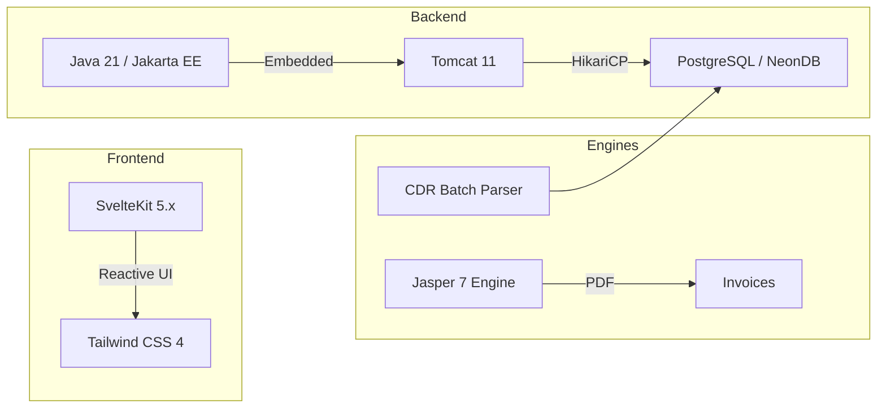

# 📱 FMRZ Telecom Billing System v2.0

<p align="center">
  <a href="#">
    
  </a>
  <a href="#">
    
  </a>
  <a href="#">
    
  </a>
  <a href="#">
    
  </a>
</p>

> [!IMPORTANT]
> **Carrier-Grade Billing**: A high-performance, modular telecommunications billing engine. Featuring **JDBC Batch Ingestion**, **Triple-Lane Usage Auditing**, and **Automated 14% VAT Financial Settlement**.

---

## 🚀 High-Performance Highlights

### ⚡ Batch Ingestion Engine
Our new **JDBC Batch Parser** handles high-density CDR volumes by grouping **1,000 records** per database transmission. This eliminates network latency bottlenecks and allows for near-instant rating of massive usage files.

### 📊 Triple-Lane Usage Auditing
The Admin Dashboard features a revolutionary **Triple-Lane Grid** (Voice | Data | SMS).
*   **Visual Scannability**: Each service type has dedicated micro-icon lanes.
*   **Total Transparency**: The "Total (Inc. Tax)" column explicitly confirms that all 14% Government VAT and overages are calculated.

### 🛡️ Graceful Rejection Audit
Usage records for suspended or invalid accounts are no longer simply "lost." The system automatically routes them to the **`rejected_cdr`** audit log, allowing administrators to track attempted usage and potential revenue leaks.

### 🔄 Billing Cycle Aggregation
The **"Run Billing Cycle Now"** button triggers the `generate_all_bills()` stored procedure which:
1. Expires add-ons from the previous period (`expire_addons()`)
2. Iterates through all active contracts
3. Aggregates usage from `contract_consumption` (Voice/Data/SMS as BIGINT)
4. Calculates overage charges from `ror_contract` table
5. Applies **14% VAT** in the stored procedure
6. Creates bill records with **NUMERIC(12,2)** precision

---

## 🏗️ Architecture Stack



### Layer Details

| Layer | Technology | Version | Purpose |
|:------:|:----------|:--------:|:--------|
| 💻 **Backend** | Java | 21 | High-concurrency core |
| 🗄️ **Database** | NeonDB | Cloud | Scalable PostgreSQL storage |
| 🔄 **Pool** | HikariCP | 6.2.1 | Ultra-fast connection management |
| 📊 **Reports** | JasperReports | 7.0.1 | Pixel-perfect PDF invoicing |
| 🎨 **Frontend** | SvelteKit | 5.x | Modern Reactive UI |

---

## 🚂 Deployment

### Railway Deployment

The app is configured for seamless deployment on **Railway** with automatic health checks and environment variable support.

```
┌─────────────────────────────────────────────────────────────────┐
│                 RAILWAY SETUP                                    │
├─────────────────────────────────────────────────────────────────┤
│  🚂 Platform          │  Railway (railway.app)                 │
│  🌐 Database         │  NeonDB (your project)                │
│  🔌 Connection       │  JDBC with SSL required                │
│  ❤️ Health Check     │  GET /health                          │
│  📦 Build            │  Docker multi-stage build             │
│  🔄 Deploy           │  Automatic on git push              │
└─────────────────────────────────────────────────────────────────┘
```

### Environment Variables

| Variable | Description | Example |
|:---------|:------------|:--------|
| `DB_URL` | NeonDB JDBC URL | `jdbc:postgresql://your-endpoint.neondb?sslmode=require` |
| `DB_USER` | Database user | (from NeonDB dashboard) |
| `DB_PASSWORD` | Database password | (from NeonDB dashboard) |
| `CDR_INPUT_PATH` | Input directory | `/app/input` |
| `CDR_PROCESSED_PATH` | Processed directory | `/app/processed` |

### Railway Health Check

```bash
# Health endpoint (used for deployment detection)
GET https://your-app.railway.app/health

# Response:
# {"status":"UP","timestamp":"2026-04-30T12:00:00Z"}
```

### Deploy to Railway

```bash
# 1. Install Railway CLI
npm i -g @railway/cli

# 2. Login
railway login

# 3. Init project
railway init

# 4. Set environment variables (from NeonDB dashboard)
railway variables set DB_URL="jdbc:postgresql://..."
railway variables set DB_USER="..."
railway variables set DB_PASSWORD="..."

# 5. Deploy
railway deploy

# Or connect GitHub repo for auto-deploy:
# https://railway.app/new
```

### Docker Configuration

```dockerfile
# Multi-stage build for Railway
FROM maven:3.9.6-eclipse-temurin-21 AS build
WORKDIR /build

COPY pom.xml .
RUN mvn dependency:go-offline -B

COPY . .
RUN mvn package -DskipTests -B

FROM eclipse-temurin:21-jre-jammy
WORKDIR /app

# Security: Run as non-root user (Container Security Law)
RUN addgroup --system javauser && adduser --system --ingroup javauser javauser

# Install curl for health checks
RUN apt-get update && apt-get install -y curl && rm -rf /var/lib/apt/lists/*

# Create directories
RUN mkdir -p /app/input /app/processed && chown -R javauser:javauser /app

# Copy artifacts
COPY --from=build /build/target/Telecom-Billing-Engine.jar app.jar
COPY --from=build /build/target/lib ./lib
COPY --from=build /build/src/main/webapp ./webapp_static
COPY --from=build /build/src/main/resources/invoice.jrxml .
COPY --from=build /build/src/main/resources/logo.svg .
COPY --from=build /build/src/main/resources/Pictures ./Pictures

# Set ownership (javauser:javauser for all volumes)
RUN chown -R javauser:javauser /app

# Switch to non-root user
USER javauser

# Expose port
EXPOSE 8080

# Health check
HEALTHCHECK --interval=30s --timeout=10s --start-period=40s --retries=3 \
  CMD curl -f http://localhost:8080/health || exit 1

# Run command
ENTRYPOINT ["java", "-Xmx1g", "-Djava.awt.headless=true", "-cp", "app.jar:lib/*", "com.billing.Main"]
```

**Security & Permission Guardrails**:
- Container volumes owned by `javauser:javauser`
- Sensitive DB credentials read from **Environment Variables** (never hardcoded)
- Non-root execution enforced

---

## ✨ Key Features

### 👑 Admin Features

| Feature | Endpoint | Description |
|:--------|:---------|:------------|
| 📊 **Dashboard** | `/admin` | Real-time stats & metrics |
| 👥 **Customers** | `/admin/customers` | Full customer CRUD |
| 📄 **Contracts** | `/admin/contracts` | Contract management |
| 💰 **Billing** | `/admin/bills` | Bill generation & payment |
| 📈 **CDR** | `/admin/cdr` | CDR upload & viewing |
| 📦 **Packages** | `/admin/service-packages` | Service packages |
| 📵 **Rate Plans** | `/admin/rateplans` | Tariff plans |
| 🔍 **Audit** | `/admin/audit` | Missing bill detection |

### 👤 Customer Features

| Feature | Endpoint | Description |
|:--------|:---------|:------------|
| 👤 **Profile** | `/profile` | View & edit profile |
| 📱 **Contracts** | `/profile/contracts` | My contracts |
| 📄 **Invoices** | `/profile/invoices` | Invoice history |
| 📥 **Download** | `/profile/invoices/download` | PDF downloads |
| 🛒 **Add-ons** | `/customer/addons` | Purchase add-ons |
| 📝 **Register** | `/register` | Self-registration |

### ⚙️ Backend Features

| Feature | Description |
|:--------|:------------|
| 🗂️ **CDR Engine** | Java CSV parser with JDBC Batching (1,000/batch) |
| 🧪 **CDR Generator** | Test data generation |
| 📄 **JasperReports 7** | PDF with strict XML schema (element-kind) |
| 🤖 **Financial Engine** | Database-first: 14% VAT in `generate_bill()` stored procedure |
| ❤️ **Health** | Railway-compatible `/health` endpoint |
| 📊 **Rejection Audit** | `rejected_cdr` table for failed/suspended CDRs |

---

## 🚀 Quick Start

### Development (IDE)

```bash
# 1. Configure secrets
cp .env.example .env

# 2. Edit .env with your NeonDB credentials
# DB_URL=jdbc:postgresql://your-endpoint.neondb?sslmode=require
# DB_USER=your_username
# DB_PASSWORD=your_password

# 3. Run in IntelliJ
#    File → Project Structure → Run Configurations
#    Select Main class → Environment → .env file

# 4. Run
com.billing.Main
```

### Production (Railway)

```bash
# Option 1: Deploy via GitHub (recommended)
# 1. Push code to GitHub
# 2. Create project at railway.app
# 3. Connect GitHub repository
# 4. Add environment variables in Railway dashboard
# 5. Deploy automatically on push

# Option 2: Deploy via CLI
railway init
railway deploy
```

### Production (Local Container)

```bash
# Build the JAR
./mvnw clean package -DskipTests

# Launch with Podman/Docker
podman-compose up -d --build

# Verify health
curl http://localhost:8080/health
```

---

## 🗄️ Database Schema

### NeonDB Configuration

```
┌─────────────────────────────────────────────────────────────────┐
│                  NEONDB CONFIGURATION                            │
├─────────────────────────────────────────────────────────────────┤
│  🌐 Service          │  NeonDB Cloud                           │
│  📍 Endpoint        │  (your-project-name)                   │
│  📂 Database        │  neondb                               │
│  🔒 SSL             │  Required (sslmode=require)            │
│  🔄 Pooling         │  HikariCP with 10 connections          │
│  💾 Type            │  PostgreSQL compatible               │
└──────��─��────────────────────────────────────────────────────────┘
```

### 14 Tables

```
┌─────────────────────────────────────────────────────────────────┐
│                      CORE TABLES                                │
├─────────────────────────────────────────────────────────────────┤
│  user_account          │  Customers & administrators         │
│  rateplan            │  Tariff plans                        │
│  service_package    │  Bundled services                   │
│  rateplan_service_package │  Rateplan ↔ Package links       │
│  contract           │  Customer contracts                 │
│  contract_consumption│  Usage tracking                    │
│  ror_contract       │  Applied rates                      │
│  bill               │  Billing invoices                  │
│  invoice            │  PDF records                      │
│  cdr                │  Call detail records               │
│  file               │  CDR file tracking                │
│  rejected_cdr       │  Rejected records                 │
│  contract_addon     │  Customer add-ons                 │
│  msisdn_pool        │  Phone number pool                │
└─────────────────────────────────────────────────────────────────┘
```

### 60+ Functions

```sql
-- Core Billing
SELECT generate_bill(1, '2026-04-01');
SELECT generate_all_bills('2026-04-01');

-- Contract Management
SELECT create_contract(1, 2, '201000000001', 500);
SELECT change_contract_status(1, 'suspended');
SELECT change_contract_rateplan(1, 2);

-- Customer
SELECT login('username', 'password');
SELECT get_all_customers('search', 50, 0);

-- Add-ons
SELECT purchase_addon(1, 3);
SELECT get_contract_addons(1);
```

### 3 Triggers

| Trigger | Event | Action |
|:--------|:------|:-------|
| `trg_auto_rate_cdr` | AFTER INSERT | Auto-rate CDR |
| `trg_auto_initialize_consumption` | BEFORE INSERT | Init period |
| `trg_bill_payment` | AFTER UPDATE | Restore credit |

---

## 🔌 API Reference

### Public Endpoints

| Method | Endpoint | Description |
|:------:|:---------|:------------|
| 🟢 GET | `/health` | Health check |

### Authentication

| Method | Endpoint | Description |
|:------:|:---------|:------------|
| ⚡ POST | `/api/auth/login` | User login |
| ⚡ POST | `/api/auth/register` | New customer |
| ⚡ POST | `/api/auth/logout` | User logout |
| 🟢 GET | `/api/auth/verify` | Verify session |

### Customer

| Method | Endpoint | Description |
|:------:|:---------|:------------|
| 🟢 GET | `/api/customer/profile` | Get profile |
| 🟡 PUT | `/api/customer/profile` | Update profile |
| 🟢 GET | `/api/customer/contracts` | My contracts |
| 🟢 GET | `/api/customer/invoices` | My invoices |
| 🟢 GET | `/api/customer/invoices/download` | Download PDF |
| 🟢 GET | `/api/customer/addons` | My add-ons |
| ⚡ POST | `/api/customer/addons` | Purchase add-on |
| 🟢 GET | `/api/onboarding/available-msisdn` | Phone numbers |
| ⚡ POST | `/api/onboarding/create-contract` | New contract |

### Admin

| Method | Endpoint | Description |
|:------:|:---------|:------------|
| 🟢 GET | `/api/admin/customers` | List customers |
| ⚡ POST | `/api/admin/customers` | Create customer |
| 🟢 GET | `/api/admin/customers/*` | Get customer |
| 🟡 PUT | `/api/admin/customers/*` | Update customer |
| 🔴 DELETE | `/api/admin/customers/*` | Delete customer |
| 🟢 GET | `/api/admin/contracts` | List contracts |
| ⚡ POST | `/api/admin/contracts` | Create contract |
| 🟡 PUT | `/api/admin/contracts/*/status` | Change status |
| 🟡 PUT | `/api/admin/contracts/*/rateplan` | Change rateplan |
| 🟢 GET | `/api/admin/cdr` | List CDRs |
| ⚡ POST | `/api/admin/cdr/upload` | Upload CDR |
| ⚡ POST | `/api/admin/cdr/generate` | Generate test |
| 🟢 GET | `/api/admin/bills` | List bills |
| ⚡ POST | `/api/admin/bills/*/pay` | Pay bill |
| ⚡ POST | `/api/admin/bills/generate-all` | Generate all |
| 🟢 GET | `/api/admin/stats` | Dashboard stats |
| 🟢 GET | `/api/admin/audit/missing` | Missing bills |

---

## 🛡️ Security Audit

| Component | Status | Description |
|:---------|:------:|:------------|
| 🔐 **Identity** | ✅ | Non-root `javauser` |
| 🔒 **Secrets** | ✅ | Environment variable priority |
| 📊 **Observability** | ✅ | `/health` endpoint |
| 🔧 **Build** | ✅ | LICENSE/NOTICE merge |
| 📄 **Reporting** | ✅ | JIT caching |
| 🌐 **Assets** | ✅ | Container-native |
| 🔀 **Routing** | ✅ | SPA normalization |
| 🎨 **Frontend** | ✅ | State fixes |
| 💳 **Billing** | ✅ | Idempotent upsert |
| 🚂 **Railway** | ✅ | Auto-deploy ready |

---

## 📊 Reporting Engine

### JasperReports 7 Compliance

The system uses JasperReports 7.0.1 with strict XML schema requirements:

- **element-kind Attributes**: All template elements must include proper `element-kind` attributes (e.g., `<image element-kind="Graphic">`, `<textField element-kind="Text">`)
- **JasperLoader**: Custom utility class caches compiled templates in memory (JIT compilation avoided on every request)
- **Font Merging**: Maven AppendingTransformer prevents font file overwrites

### Invoice Generation Flow

```
Admin Dashboard → "Run Billing Cycle Now" → generate_all_bills()
                                                    ↓
                                              create bill records
                                              (14% VAT applied)
                                                    ↓
                                         JasperReports PDF generation
                                                    ↓
                                         /profile/invoices/download
```

---

## 🗺️ Roadmap

### Phase 3: Advanced Auditability

```
┌─────────────────────────────────────────────────────────────┐
│                  CARRIER-GRADE FEATURES                    │
├─────────────────────────────────────────────────────────────┤
│  cdr_rating_detail    │  Per-bundle consumption audit    │
│  Multi-Bucket       │  Split across rating events  │
│  Itemized Logs      │  Millisecond-accurate trail│
│  Dual Rating       │  Wholesale & retail rates │
└─────────────────────────────────────────────────────────────┘
```

---

<div align="center">

### 📱 FMRZ Telecom Group

**Version 2.0** | **April 2026** | **Production Ready** 🏎️🛡️🚀

</div>